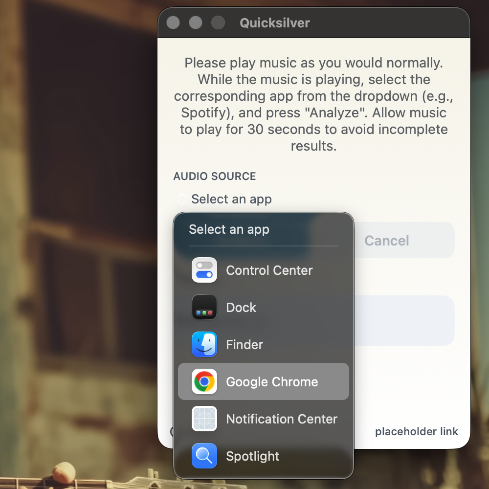
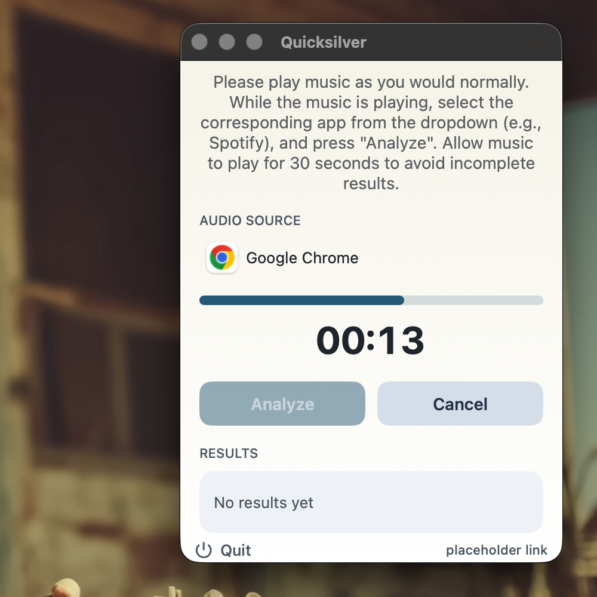
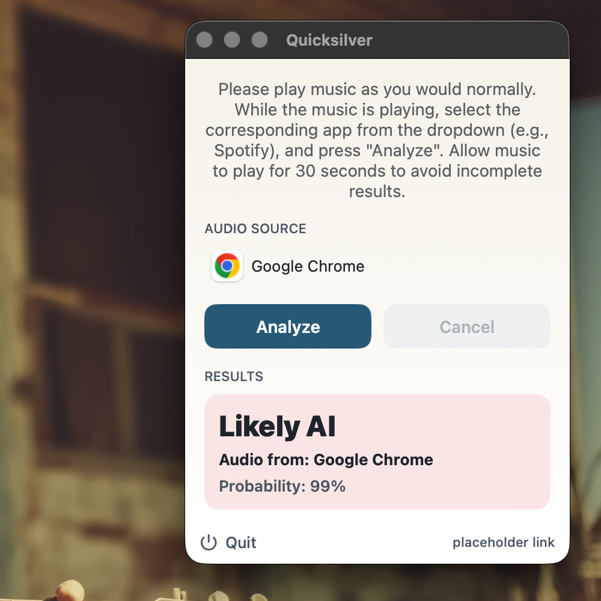
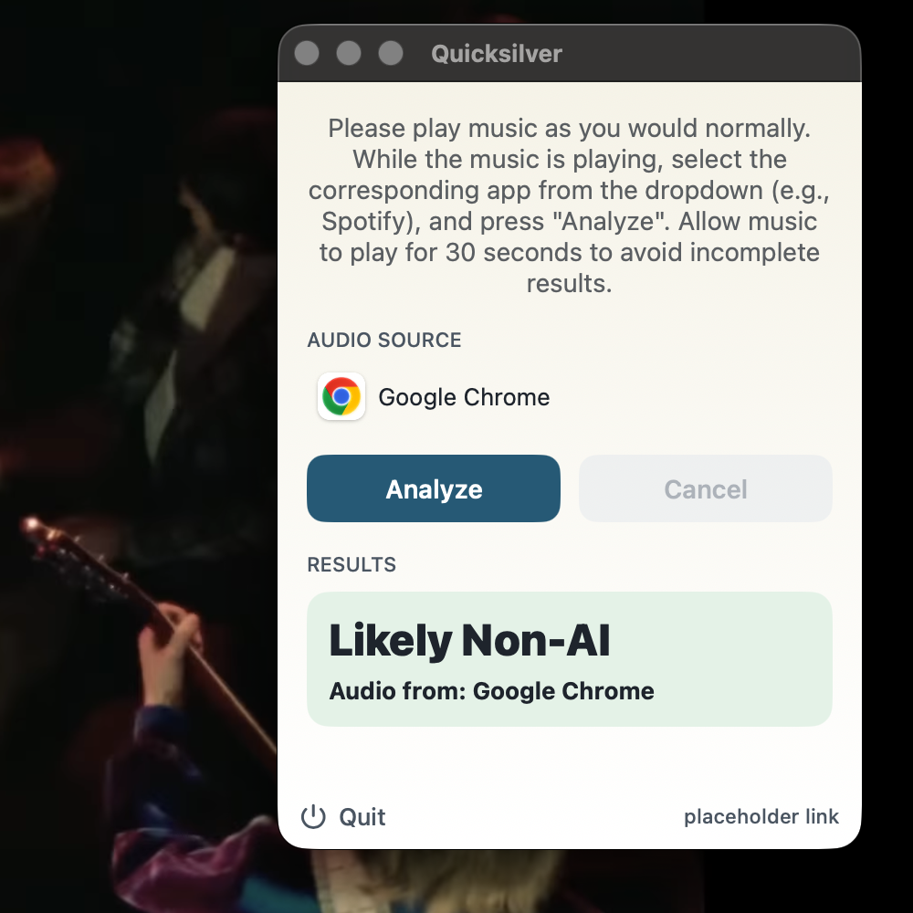

# Quicksilver MacOS
This is a MacOS app for the [Quicksilver browser extension](https://github.com/stanleykywu/quicksilver-browser-extension), which allows users to quickly check if music they are listening to is AI-generated. This app works by directly analyzing music audio from your computer for artifacts music commonly found in AI-generated music. In other words, if your computer can play it, Quicksilver can directly classify the audio without you needing to download it or upload it anywhere. If you are looking for development setup, please look [here](#setup-instructions). If you are looking for our browser extension, please look [here](https://github.com/stanleykywu/quicksilver-browser-extension).

## What is Quicksilver?

AI-generated music has grown incredibly quickly since 2024. Since then, our research has found that up to half of new songs uploaded to platforms like Spotify are now AI. Much of these AI songs are low quality, low effort AI music, with many even posing as legitimate, human musicians. In response, AI music detection has been proposed as a way to label and inform listeners on what songs are AI or not. However, as of this writing, the only place where AI songs are labeled this way is on the Deezer music streaming platform. While we believe this is a step in the right direction for AI transparency, we believe users should have access to the necessary tools to easily determine whether any given music is AI-generated or not, and not just that uploaded to certain platforms.

In an effort to address this, we have designed and implemented Quicksilver, a fast and low latency app, which when given permission by the user, can analyze any audio from computer (currently requiring 30 seconds), and quickly identify if it contains AI-generated music artifacts. Our detector is a lightweight machine learning model (only 37KB!) based on the [published results from Deezer’s research team](https://github.com/deezer/ismir25-ai-music-detector), which identified artifacts found in Suno/Udio songs. This was the best performing approach we found in our research.

Currently, our understanding is that almost all fully AI-generated songs are produced by either the Suno or Udio platform. As such, our model was trained with the goal of detecting Suno and Udio songs, while making sure non-AI songs are not mislabeled as AI (low false positive rate). Our current detector identifies AI songs 98% of the time and has a low false positive rate (<0.02%).

## How to use Quicksilver (+ Examples)
After you have installed Quicksilver, please read the following instructions on how to use Quicksilver and how to interpret its results.

### Using Quicksilver
Quicksilver directly analyzes the audio that comes from your computer. All you need to do is play music as you would normally, select the app that is playing the music in the Quicksilver application window, then click the "Analyze" button. After clicking "Analyze", please allow the music to play for a full 30 seconds to avoid incomplete results. Please refer to the following screenshots for examples.

| | |
|---|---|
| 
Selecting audio source
 | 
Analyzing audio
 |
| 

 | 

 |
| 
AI detected
 | 
AI not detected
 |
| 

 | 

 |

Notes:
* Your computer does not need to be unmuted for Quicksilver to analyze audio. However, the application in which you play audio from should not be muted. Quicksilver will warn you if it detects a significant amount of silence in the analyzed audio.
* Feel free to click out of the Quicksilver window while the countdown is ticking, it will continue to run in the background

### Interpreting Qucksilver Outputs
Quicksilver outputs binary results, i.e, it has two outputs: `Likely Non-AI` and `Likely AI`. `Likely AI` means that our model detected evidence of AI-generated artifacts in the music, and that the amount of evidence crossed a high enough threshold which we manually set. Likewise, an output of `Likely Non-AI` means that the model _did not_ find enough evidence of AI music for us to confidently say the song is AI. In other words, a `Non-AI` result **should not** be used as evidence that the provided music is human-made. 

For `Likely AI`, we also output the probability returned by our AI-music detector. This figure **should not** be interpreted as the percentage of the song that is AI. As we have mentioned earlier, Quicksilver is designed to identify **fully AI-generated songs**. This percentage is merely a confidence level of whether the song contains artifacts commonly assosciated with AI-generated songs.

### Quick Testing
If you would like to make sure Quicksilver is working correctly. Please test it on the following two YouTube videos:

[AI Music](https://www.youtube.com/watch?v=wnzI8q5NiqA)

[Human Music](https://www.youtube.com/watch?v=xFrGuyw1V8s)

## Limitations
1. Our model depends heavily on the AI songs it is trained on. Version 1.x is only trained to detect AI songs generated by Udio v1.5 and Suno v5. Songs generated by (potentially) newer versions of Suno/Udio may not be classified as AI. We will attempt to update our model if and when new versions are released.
2. Our model is not trained to detect open source models like DiffRhythm or ACE-Step. Based on our research paper, it does not seem like many people are using these models to generate and publish music (yet).
3. We do not claim our model is robust to audio augmentations. We are actively working to improve the robustness of our model, but we note here that motivated adversaries can intentionally edit their AI songs to avoid detection.
4. We are currently only able to develop Quicksilver as extensions Google Chrome and Microsoft Edge, and MacOS. If you do not use any of these, please reach out to us. We would like to extend Quicksilver to other platforms in the future.
 
## What makes Quicksilver different from online detectors like SubmitHub, Hive, …, etc.?
The goal of Quicksilver is to be fast, require as little effort as possible to use, and perform well. Quicksilver is based on an AI music detector that worked the best out of all other open source options. As such, instead of requiring users to first download music files, then upload to an online service, our detector directly analyzes music being played on your computer, and classifies it. Additionally, since the model is lightweight, it runs directly on your computer without needing the audio file to be sent anywhere. Finally, we open sourced our code on GitHub, and are always open to improvements, suggestions, and comments.

## Does Quicksilver work on audio deepfakes?
No. Our model is designed to detect Suno and Udio generated _music_. If the deepfake was created using one of those tools (i.e., using Suno to generate an AI song in the style of Michael Jackson), our model should be able to detect it. However, our model is not trained to detect pure speech generated by AI (like that of ElevenLabs), since those use different models other than Suno/Udio.

## Setup instructions

### Set up Xcode project workspace
- After pulling updates from github, open Xcode, select "open existing project",
and choose Quicksilver.xcodeproj in the file picker.
- This should automatically open all project files and pull in Swift dependendencies.
### Compile Rust backend and link to the Swift bridge
- Run `cargo build --release` in the root directory.
- This will build our Rust backend: `target/release/libquicksilver.a`
- Drag `libquicksilver.a` to our Xcode project files.
- When prompted, select "Quicksilver" as the only target and choose the "copy" option.
### Check app permissions
- Navigate to the target info by clicking on "Quicksilver" target in the file menu bar
- Open "Signing & Capabilities" tab
- Sign in to our team account (right now Stanley's Apple Developer account)
- Make sure "Signing Certificate" is set to "Development"

## Running the app

### Build
- Build the app by clicking on the "run" button
- This will automatically start running the app

### Grant permissions
- After you click "Analyze" for the first time, MacOS should prompt you to grant our app recording permissions
- Grant permissions in the system settings and click "Quit & Reopen" option that should pop up